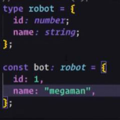

quarta-feira, 6 de novembro de 2024 18:30

Olá pessoal 

Aqui nesse projeto estou recriando uma interface

Através da parceria da comunidade DIO com a Deal, estou  aprendendo Front com Angular 

Aqui estão todos os passos iniciais, 

Desde que entender como o typescript funciona, até a criação de um sistema de páginas Pegando de forma autônoma as informações que vêm de um banco de dados e puxando a vizualição atraves de IDs

15 - Typescript - Performance do JS

segunda-feira, 7 de outubro de 2024 17:18

Da para pensar que o TS é um JS aprimorado, 

Onde não permitira lançar a aplicação com erro

É literalmente uma TIPAGEM DO JAVASCRIPT == TypeScript

Para mostrarmos isso, vamos primeiro iniciar com TS para depois ingressar de fato no Angular

O JS seria o Tonny

O TS seria o IRON MAN

Com o Typescript podemos tipar o JS

Isso serve para definir tipos previsiveis da variavel

No TS temos Classes como no Back

Classes podem ser interfaces que todos que trabalharem com ela, precisam respeitar

No TS temos o ENUMS tambem passando tipos previsiveis de maneira mais facil

Página 1 de Nova Seção 1

15,2 - Instalando e Configurando o TS

segunda-feira, 7 de outubro de 2024 17:49

Para instalar o TS, podemos entrar no site do TS Clicando em Download

Se já temos o NODE JS instalado na maquina

Automaticamente temos o NPM e o NPX

Se caso não. Necessario instalar o node 

Temos duas maneiras de baixar o TS, atraves do projeto, ou mais abaixo no site, de forma global na maquina

Página 1 de Nova Seção 1

Quando quero rodar o TS dentro do projeto, podemos fazer como da primeira print Vai que em cada projeto, precisemos de uma versao diferente

Página 1 de Nova Seção 1

15,1 TS o que melhora?

segunda-feira, 7 de outubro de 2024 18:15

Em JS podemos ter a seguinte performance 

O primeiro retorno com o numero O segundo sem numero

O primeiro retornou um numero, o segundo não encontrou, mas ao inves de retornar erro, retornou Undefined

Com TS podemos criar tipo CONSTRUTOR onde conseguimos definir o que é necessario 

Dessa forma, tipando-o, podemos definir o que é e o que não esta certo, como ali acusando que não tem o Telefone

Sabemos que precisamos inserir o telefone

Página 1 de Nova Seção 1

Página 1 de Nova Seção 1

15,2,1 - Instalando e Configurando o TS

segunda-feira, 7 de outubro de 2024 19:19

Para instalar dentro do projeto, se certifique que esta na pasta padrao do projeto RODAR "npm init -y" PARA INICIAR O PROJETO NODE NA RAIZ

Assim que na pasta do projeto, rodar esse comando

npm install typescript -D

Esse -D insere uma dependencia de Dev/Debug

Isso impede de publicar ou fazer deploy do projeto, deixando somente em ambiente de teste

Esse comando criou um projeto TS

O SRC criei eu mas não sei se não criar ele cria sozinho

Página 1 de Nova Seção 1

15,2,2 Iniciando com TS

segunda-feira, 7 de outubro de 2024 19:33

Note como é utilizado o index.ts

!!! Algumas dessas funcoes/construtores/type não existem em JS

!!! Se algumas chamadas nao existem em JS, quando a chamada node src/index.ts for realizada

O codigo ira compilar o que ele entender e retornar erro no que não entender, vai crashar

Para isso, precisamos antes de mais nada "TRADUZIR O CODIGO PARA JS"

Utilizando do NPX - Node Package Execute como na print abaixo

No entanto quando traduzido, os dois estao na mesma classe SRC e dessa forma ele da erro se identifica a mesma Function 2x ou mais repetidamente

Da para entender que se rodarmos o TS o node não entende TS e trava o codigo,

Se rodamos o JS ele entende e roda sem as travas do TS

Ou seja, o TS é um controle, uma segurança, um "gateway" para o JS mas no fim, o codigo traduzido e depois executado, sera o JS

Página 1 de Nova Seção 1

PARA ISSO, AGORA NECESSARIO MEXER NAS CONFIGURAÇÕES DO NODE 

Página 1 de Nova Seção 1

15,2,3 Configurando TS e Node -> npx tsc --init | ts.config

segunda-feira, 7 de outubro de 2024 19:38

PRECISAMOS RESOLVER 2 CHATICES DO CODIGO

1. O FATO DELE CRIAR SEMPRE O ARQUIVO EM JS DO TS TRADUZIDO 
1. O FATO DE TER QUE SEMPRE TRADUZIR UM POR UM DOS ARQUIVOS

`   `!!!!!!!!!! PARA ESSAS CONFIGURAÇÕES, NECESSARIO UM ARQUIVO CONFIG !!!!!!!!!! Para iniciar esse arquivo de configuração

|Necessario jogar o comando do NPX|NPX TSC --INIT|
| - | - |

Dessa forma conseguimos gerenciar elementos e configurações

Para saber mais o que habilitar ou desabilitar, verificar em TS CONFIG dentro do site do Typescript

Quando gerado esse --init

Ele gera um config, com ele conseguimos ver as diversas configurações que podemos realizar

Página 1 de Nova Seção 1

VEJA QUE TANTO ESSE ROOTDIR E ESSE OUTDIR, REMOVI DOS COMENTARIOS

ROOT DIR

Dessa forma, quando npx tsc src... Se eu não especificar o caminho, por padrao ele vai traduzir tudo de src

OUT DIR

O que é traduzido ira para a pasta /build, dessa forma não ficara mais junto como em SRC/INDEX.TS

Dessa forma, agora quando somente npx tsc... Dessa forma em Build/index.js...

Ele traduziu para Build, futuramente consequentemente rodando node para JS, ele executou normalmente

Se quisermos fazer isso como em start.io

Página 1 de Nova Seção 1

Se quisermos fazer isso como em start.io

Em PLAYGROUND já deixa tudo preparado da tambem, mas é mais informativo para o futuro, da primeira forma

Página 1 de Nova Seção 1

15,2,4 Configurando Node

segunda-feira, 7 de outubro de 2024 20:37

Para deixar ainda mais facil de rodar um projeto 

De forma a traduzir o codigo TS e ainda rodar o que foi definido em Build/index.js

Necessario abrir o arquivo package.json (criado primeiro com o "**npm init -y**" para iniciar o projeto node eo "**npm install typescript -D**" para criar projeto TS)

Em SCRIPT, adicionar START e as config...

"start": "npx tsc && node build/index.js",

"

Dessa forma jogando um npm run start

Rodando o START, conseguimos iniciar o que esta dentro dele

Página 1 de Nova Seção 1

15,3 Tipos de Dados

terça-feira, 8 de outubro de 2024 19:20

Dentro do TS, 

TIPOS PRIMITIVOS 

Temos 3 tipos primitivos

|BOOLEAN|NUMBER|STRING|
| - | - | - |

Com os tipos que definimos variaveis Como declarar os tipos primitivos...

TIPOS NULL E INDEFINIDOS

Quando não queremos que o usuario altere ou por alguma razao ele deve permanecer nulo

TIPOS ABRANGENTES

Quando queremos que o retorno seja vazio ou quando não temos como saber como sera seu retorno

OBJETOS

SEM PREVISIBILIDADE

COM PREVISIBILIDADE

Objetos normais como em outras linguagens, podendo instanciar mais de um objeto20de maneira padronizada

Página 1 de Nova Seção 1

Página 1 de Nova Seção 1

15,2,5 Sugestoes do ChatGPT para o config do TS

terça-feira, 8 de outubro de 2024 19:45

A sua configuração de tsconfig.json está bem organizada e cobre aspectos importantes como a compatibilidade de módulos, saída dos arquivos compilados e verificação rigorosa de tipos. Aqui vão algumas sugestões que podem ser úteis, dependendo das suas necessidades:

1. **"moduleResolution": "node"**: Se você estiver trabalhando com Node.js ou bibliotecas que seguem a resolução de módulos do Node.js, isso pode ajudar a evitar problemas de resolução de dependências.

   json

   Copiar código

   "moduleResolution": "node"

2. **"resolveJsonModule": true**: Se você precisar importar arquivos JSON diretamente no TypeScript, essa opção pode ser útil.

   json

   Copiar código

   "resolveJsonModule": true

3. **"declaration": true**: Gera arquivos .d.ts, úteis para quem vai publicar pacotes ou se outras pessoas ou sistemas vão usar o código.

   json

   Copiar código

   "declaration": true

4. **"sourceMap": true**: Se você precisar debugar o código JavaScript gerado, isso cria mapas de fonte que ajudam a fazer referência ao TypeScript original.

   json

   Copiar código

   "sourceMap": true

5. **"removeComments": true**: Se você quiser que os comentários não apareçam no código JavaScript compilado, pode ativar isso.

   json

   Copiar código

   "removeComments": true

6. **"strictNullChecks": true**: A verificação estrita de null e undefined evita muitos erros de execução, então, se estiver lidando com muitos valores opcionais, pode ser uma boa prática.

   json

   Copiar código

   "strictNullChecks": true

Essas opções oferecem um equilíbrio entre otimizações e verificações rigorosas que podem ajudar a melhorar a qualidade do código.

Página 1 de Nova Seção 1

15,4 TS Arrays

terça-feira, 8 de outubro de 2024 20:39

Quando queremos criar um Array 

Trabalhando com Array Unidimensional 

Podemos fazer de 2 formas, de forma clara ou facilitada

Podemos tambem trabalhar com arrays com mais de um dado, como definido abaixo, 

TIPO STRING E NUMBER (Number independente de Decimal ou Inteiro)

NO ENTANTO ELE NÃO VAI JUNTAR O 1° COM O 2, 

TANTO QUE ELES NEM PRECISAM ESTAR EM ORDEM

Página 1 de Nova Seção 1

15,4,1 TS Tuplas

terça-feira, 8 de outubro de 2024 20:49

Vetor com multi-elementos

Com já visto no anterior, TUPLAS são feitas da seguinte forma

A diferenca de um VETOR COM MULTIPOS ELEMENTOS,

A Tupla respeita a forma que foi informado, sendo que se esquecer um "" ou informar um tipo "certo" mas na ordem errada, ele retorna um erro

SE ESQUECER UM ELEMENTO OU DEFINIR UM TIPO ERRADO É A MESMA COISA

Página 1 de Nova Seção 1

15,5,2 Manipulação de Arrays em TS/JS

terça-feira, 8 de outubro de 2024 21:29

Dentro dos ARRAYS, temos metodos que conseguimos manipular os Arrays

Comandos mais comuns para mapear elementos/ filtra-los, remove-los... Enfim, gerenciar os elementos

.map -- mapeia objetos

.reduce

.pop -- remove o ultimo elemento .filter -- filtra algo especifico

Página 1 de Nova Seção 1

15,5 Trabalhando com Dates

terça-feira, 8 de outubro de 2024 21:37

Para organizar datas, prcisamos iutilizar da biblioteca e filtrando do padrao americano

Como bem observado, melhor definir com a hora, senao necessario uma configuração futura

Página 1 de Nova Seção 1

15,6 Funções

terça-feira, 8 de outubro de 2024 22:11

Assim como no JS, para criar uma Função, podemos simplesmente criar uma FUNCTION

Temos duas maneiras dai de manipula-las,

visando futuramente, 

de maneira explicita é melhor

Página 1 de Nova Seção 1

15,6,1 Funções Multi-Tipos

terça-feira, 8 de outubro de 2024 22:22

Quando caso em uma aplicação ou manipulação do Banco de Dados

Se definimos que ele deve retornar em um tipo e ele retorna em outro tipo

Ou definimos que ele é nulo, mas ele retorna String ou outro, 

Para evitar isso

É sempre bom definir quais os tipos que ele pode retornar

"

Página 1 de Nova Seção 1

15,6,2 Funções Assincronas

terça-feira, 8 de outubro de 2024 22:32

São funções que entra um tipo de dados

E queremos que retorne outro tipo de dados ou um conjunto de tipos, (Seja String ou Number) Async function... : 

LEMBRE-SE SEMPRE QUE DEPOIS DO : É O QUE ELE RECEBE

Em Java é feito no começo *(PUBLIC VOID/ PUBLIC INTEGER ...)*

Em JS é no final da Function

Página 1 de Nova Seção 1

15,7 TS Interfaces Single or Multityple

quarta-feira, 9 de outubro de 2024 18:33

Interfaces são parecidas com TYPE

*TYPE* fazem produtos, objetos agregados de varias propriedades

Mais utilizado quando queremos tipar algo

*INTERFACES*, parecido com TYPE, mas  são bastante usados quando trabalhando com classes

Da para relacionar como um contrato compra

Se vc quer utilizar daquilo, deve seguir as clausulas desse contrato

Dessa forma, se utiliza da Interface, necessario utilizar das suas variaveis

Podemos fazer essa interface aceitar mutiiplos tipos em uma variavel Podemos tambem fazer um elemento ser somente leitura

Com esse  modo READ ONLY

Ele não deixa alterar a variavel

Perceba, que no BOT ele permitira a alteração do ID mas em IRONMAN que foi definido como READONLY ele impedira essa alteração

Página 1 de Nova Seção 1

Página 1 de Nova Seção 1

15,8 Type or Interface

quinta-feira, 10 de outubro de 2024 20:56

INTERFACE

Quando estivermos mexendo com classes

Utilizamos A INTERFACE

DE FORMA QUE IMPLEMENTS

UMA INTERFACE DENTRO DE UM OBJETO DEVE SER ASSIM

Como implementar uma pessoa com a interface robot em Pessoa 

***const pessoa = new Pessoa(1,"Andre");***

TYPE

Quando queremos somente tipar um objeto Definir a forma e as constantes de variavel

Utilizamos O TYPE

Página 1 de Nova Seção 1

15,2,2  Comandos Iniciais para programação com TS no Node

sexta-feira, 11 de outubro de 2024 20:48

INICIALMENTE, PRECISAMOS INICIAR O PROJETO NODE ***Dentro do Diretorio do Projeto***

"npm init -y"

DEPOIS PRECISAMOS INSTALAR O TYPESCRIPT EM MODO DE DESENVOLVEDOR PARA NÃO FICAR JOGANDO ATUALIZAÕES EM AMBIENTE PRODUÇÃO

"npm install typescript -D"

EM SEGUIDA ABRIR UM ARQUIVO CONFIG TS NO PROJETO 

"npx tsc --init"

|---|PREPARAR O CONFIG|15,2,3|---|
| - | - | - | - |

DENTRO DA CLASSE "package.json" INSERIR EM "script"     "start": "npx tsc && node build/index.js",

Em seguida, dentro do diretorio do projeto

npm start 

Página 1 de Nova Seção 1

15,9 Classes em TS

sexta-feira, 11 de outubro de 2024 21:30

Imagine que temos uma character/personagem Todos tem o mesmo padrao

Declaramos da sequinte forma a prmieiro momento

Ele esta com erro pois falta a implementação do Construtor

OBSERVAÇÃO DO JS e TS 

Uma coisa legal é que se vc quer dizer que um método é necessário ou não

Pode simplesmente colocar um "?" na frente dele

Dessa forma, não precisa nem colocá-lo em um Construtor 

Pois afinal ele não dará essa obrigatoriedade de chamá-lo

Outra coisa, já mencionado antes mas vale a pena ressaltar

É o READONLY onde conseguimos fazer um CONSOLE.LOG mas não conseguimos setar esse valor quando já em produção pois é Somente Leitura

Página 1 de Nova Seção 1

Página 1 de Nova Seção 1

15,9,1 Modificadores de acesso

sexta-feira, 11 de outubro de 2024 21:47

|PRIVATE |PUBLIC |PROTECTED|
| - | - | - |

Esses tipos de modificadores falam 

|se quer que a classe se comunique com o projeto todo |PUBLIC|
| - | - |
|Se vai se comunicar com somente os seus "filhos"|PROTECTED|
|Ou somente naquela classe|PRIVATE|

Ou seja, refatorando o codigo 15,9

Vamos utilizar o metodo PRIVATE NOS ATRIBUTOS DA CLASSE

Página 1 de Nova Seção 1

15,9,2 Declarando Subclasses (HERANÇA)

sexta-feira, 11 de outubro de 2024 22:05

Temos alguns personagens 

Uns Magos, 

Outros Soldados

Dessa forma, como eles são todos personagens, 

mais contem subcategorias diferentes

Em vez de colocar tudo em todos

Podemos chamar a SUPER e atribuir mais elementos

Página 1 de Nova Seção 1

15,9,5 Trabalhando com Generics

sábado, 12 de outubro de 2024 21:14

Quando estamos lidando com o generico de algo

Quando vamos a farmacia e não tem um determinado remedio/pomada

Pedimos entao o generico daquela marca e conseguimos ter uma com a mesma finalidade

Na programação é a mesma coisa

Lembrando de JAVA onde as Generics são as "tags" <> onde dentro delas definimos o titulo, em TS não é muito diferente

NOTA!!!: AS RETICENCIAS EM TS significa que Senao tiver o GENERICS, FICA DESSA FORMA

**^> SE NAO TIVER AS GENERICS DEFINIDAS, ELE PODE INFORMAR UM STRING E NUMBER NA MESMA ARRAY,** 

`        `**AFINAL, SE NAO É DEFINIDO TIPO, QUALQUER TIPO SERVE**

QUANDO APLICADO O GENERICS, PARA DEFINIR O TIPO 

Fica dessa forma

Página 1 de Nova Seção 1

Página 1 de Nova Seção 1

15,10 TS Facilitando ainda mais o RUN do TS

quinta-feira, 17 de outubro de 2024 19:58

Até agora nós vimos como fazer O modo de Runtime do typescript

Primeiro jogando comando de NPX TSC E depois o comando de node buscando a Bild/index.HTML Mas existe um comando mais fácil do que isso ainda

Esse comando é basicamente um servidor interno gerado a cada vez que é salvo o documento

Ele gera um servidor que le o typescript

Mas para implementar ele no projeto, rodar o comando

"NPM INSTALL TS-NODE-DEV -D"

Lembrando que o -D Instala uma dependência de desenvolvedor não projeto VISTO EM 15,2,2

Depois de implementado esse comando, o próximo passo é criar um script dentro do start 

Que seria dentro da configuração package.json

||"start|-|dev": "ts|-|node|-|dev |--|respawn |--|transpile|-|only src/index.ts",|
| :- | - | - | - | - | - | - | - | - | - | - | - | - | - |
|||||||||||||||
Dessa forma, em vez de dar um START e de forma bunita fazer ele rodar normalzinho, obedecendo os comandos

E sempre DANDO RUN, DANDO RUN...

Ele não atualiza a não ser que restart a aplicação

Página 1 de Nova Seção 1

Podemos fazer dessa forma

Quando iniciado, ele permanece "online" vendo e como o comando diz 

Gerando um RESPAW

Página 1 de Nova Seção 1![ref1]

Depois de feito isso, para cancelar ou parar o projeto, ![ref1]

necessario um ***CTRL C***  

Deseja finalizar o arquivo em lotes (S/N)? ***Sim***

Página 1 de Nova Seção 1

16 Intro Decorators

quinta-feira, 17 de outubro de 2024 21:03

Quando é decorado um codigo para ser reutilizado

Como a similação vamos utilizar uma ordem da mãe

Quando você vai ao supermercado e a mãe sempre fala se você ver o leite a menos de 3 Reais você pode trazer porque é difícil dar esse valor

Sempre que você for na supermercado e ver o leite e ele estiver a menos de 3 BRL 

você vai trazer pois foi um comando gatido que foi passado

Dá para levar em consideração que isso também é uma condicional certo?

Na programação esse decorators é basicamente a mesma coisa

O ***decorators*** é realizado em cima de uma ***function***

Você define o que você quer que ela faça ou que tipo de ações vai ter quando ela for chamada E ela É injetada quando tem um "@"

Página 1 de Nova Seção 1

16,1 Implementando Decorators

quinta-feira, 17 de outubro de 2024 21:15

Para implementá-lo, necessario Ativa-lo dentro de CONFIG TS

Uma Implementação a nível de classe é feita da seguinte forma

A implementação a nível de classe eu não entendi muito bem

No entanto ela superou quando vai tira de uma forma sempre que a classe Chamar aquele método Implementação feita através de atributo é feita da seguinte forma

Esse atributo decorator em cima de um atributo Serve para determinar uma ação àquele atributo

Nesse caso como ele está dando erro 

será necessário implementar A ***Decorator*** minLength

Página 1 de Nova Seção 1

Com esses métodos foi possível fazer uma adição de lógica ao adicionar algum elemento

Esse tipo de coisa por default não existe no TS mas com o @ foi possível

Dessa forma se adicione um elemento que não tem o tamanho maior que 3

Ele dara erro

Página 1 de Nova Seção 1

Ele dara erro

É difícil mas com a implementação e com muito estudo é possível a aplicação

Embora como uma API faz esse trabalho é meio desnecessário quando você faz projetos fullstack

Página 1 de Nova Seção 1

17,1 Angular DEV

quinta-feira, 17 de outubro de 2024 21:22

Entrando no site da angular.dev

Conseguimos verificar algumas coisas bem maneiras 

- como a documentação 
- tutoriais de como utilizar algum laço de repetição ou algo do tipo 
- e uma parte chamada playground onde nós conseguimos rodar alguns códigos ver eles sendo executados na prática

TUTORIAIS

Página 1 de Nova Seção 1

17 ANGULAR JS - Intro

sexta-feira, 18 de outubro de 2024 18:39

Um framework auxilia Na construção de um codigo

Tudo o que é feito ou facilitado dentro de um framework pode ser feito sem ele **Documentaçao / Versoes / Instaladores**

**Angular 1 - foi a primeira versão onde não existia react não existia outros frameworks**

**Angular 2-16 - É também uma versão do angular porém uma versão totalmente nova pois a primeira versão dependia do javascript** 

**e a versão II até os dias de hoje** 

**é feita através do typescript**

**Angular 17 - Na versão 17 é compatível com a versão de 2 a 16 no entanto foram adicionados mais algumas facilidades**

**Angular.dev**

**Atualmente algumas coisas como estrutura de repetição e loop podem ser feitas da seguinte maneira**

Página 1 de Nova Seção 1![ref2]

**Com um simples if é possível fazer a condição seguindo com a lógica![ref2]**

Página 1 de Nova Seção 1

17,2 Instalação Angular 17+

sexta-feira, 18 de outubro de 2024 20:40

1. PRIMEIRAMENTE, VER SE O NODE ESTA BAIXADA NO PC 

1. SE ESTIVER INSTALADO OK
1. SE NÃO, BAIXAR A VERSAO LTS

2. INSTALAÇÃO ANGULAR

   Com a instalação do node ele automaticamente instala o npm

Agora para instalar o angular é necessário

DENTRO DO CMD \*\*\*COMO ADMIN

rodar o comando...

npm install -g @Angular/cli

-G para instalar globalmente na maquina CLI é Comand Line Interface 

Como foi implementado de forma GLOBAL no Windows, o Windows entendera comandos Angular

TODO COMANDO ANGULAR COMEÇA COM NG

Para verificar se foi instalado e a versao 

Ng version ou 

ng v

Página 1 de Nova Seção 1

ng v

E SE DER ERRO?

Quando aparece uma mensagem de erro de política

Normalmente é a política do computador Pois entende que aquele script pode ser malicioso e por padrão, o bloqueia

Caso esteja você não for esse problema necessário rodar esse comando para permitir que seja liberado scripts com assinaturas seguras

**Set-ExecutionPolicy RemoteSigned -Scope CurrentUser**

Para saber se deu certo necessário rodar o comando de list para listar a política RemoteSigned

**Get-ExecutionPolicy -list**

Página 1 de Nova Seção 1

17,3 Projetos Angular

sábado, 19 de outubro de 2024 00:08

Antes de começar a programação em angular 

é bom ter uma base em HTML | CSS | javascript ou typescript

Comandos NG === Comandos Angular

Ng help -> Mostra os comandos do Angular

Página 1 de Nova Seção 1

17,4 Comandos Angular GERAL

sábado, 19 de outubro de 2024 00:36

Comando para verificar os comandos  --> ng help Commands:

|`  `ng add <collection>  |Adds support for an external library to your project.|
| - | - |
|`  `ng analytics         |Configures the gathering of Angular CLI usage metrics.|
|`  `ng build [project]    |
`   `Compiles an Angular application or library into an output directory named 

dist/ at the given output path.                 

[aliases: b]
|
|`  `ng cache            |Configure persistent disk cache and retrieve cache statistics.|
|`  `ng completion       |Set up Angular CLI autocompletion for your terminal.|
|`  `ng config [json-path] [value]  |Retrieves or sets Angular configuration values in the angular.json file for the workspace.|
|`  `ng deploy [project]   |`  `Invokes the deploy builder for a specified project or for the default project in the workspace.|
|`  `ng e2e [project]     |Builds and serves an Angular application, then runs end-to-end tests [aliases: e]|
|
`  `ng extract-i18n 

[project]      
|Extracts i18n messages from source code.|
|`  `ng generate         |Generates and/or modifies files based on a schematic. [aliases: g]|
|`  `ng lint [project]      |`    `Runs linting tools on Angular application code in a given project folder.|
|`  `ng new [name]      |
Creates a new Angular workspace.                                     

[aliases: n]
|
|`  `ng run <target>      |
`    `Runs an Architect target with an optional custom builder configuration 

defined in your project.
|
|`  `ng serve [project]    |Builds and serves your application, rebuilding on file changes. [aliases: dev, s]|
|`  `ng test [project]     |Runs unit tests in a project. [aliases: t]|
|`  `ng update [packages..]         |Updates your workspace and its dependencies. See <https://update.angular.dev/>.|
|`  `ng version          |Outputs Angular CLI version. [aliases: v]|

Options:

|`  `--help     Shows a help message for this command in the console.|[boolean]|
| - | - |
|`  `--version  Show Angular CLI version.|[boolean]|

Página 1 de Nova Seção 1

17,4,1 Principais Comandos

sábado, 19 de outubro de 2024 00:42

|NG HELP |Verifica todos os comandos possíveis|
| - | - |
|NG NEW |Crie um novo espaço ou projeto para o Angular|
|NG NEW WITH ALIAS|NG N ... É iigual o NG NEW...|

Lembrando que no front diferentemente do java ou back

Quando quero jogar uma frase em vez de palavra em vez de ficar colocando maiúsculos meio da frase eu posso separá-los por traço

my-first-project

Então relembrando 

para criar um novo projeto angular necessário 

**Ng new project-angular...**

**Selecionar escopo CSS [ <https://developer.mozilla.org/docs/Web/CSS> ]**

Página 1 de Nova Seção 1

17,5 O que faz os Arquivos TS de Config?

sábado, 19 de outubro de 2024 20:05

Como visto em TS

O arquivo TSCONFIG é disponibilizado para funções que podem ser ativadas ou desativadas 

Que visam facilitar na hora do RUN ou outro momento

tsconfig.spec.json

Esse arquivo é realizado para TESTES

Note que o Arquivo EXTENDS busca de um arquivo SUPER algumas configurações Ou seja, quando chamado o EXTENDS basicamente vc pega o arquivo pai 

e muda somente o que precisa utiizarn aquele codigo

Página 1 de Nova Seção 1

17,6 Angular e Node.js

sábado, 19 de outubro de 2024 21:14

Alguns arquivos de configuração são feitos não pelo NG mas pelo Node

Pois basicamente eles andam de maos dadas 

Como por exemplo o PACKAGE.JSON que empacota/encapsula alguns detalhes do projeto e scripts Atraves dele conseguimos dar um "run" no projeto como NPM Start

Uma parte muito importante é o PRIVATE, que faz o arquivo por default ser PRIVADO

Evitando vazamento de informações

No entanto como ele faz esse private true

Quando você vai puxar novamente o projeto ou dar um update ali dar um git clone

Ele vai perder o projeto de configuração ali do package Jason e as outras configurações

Aí para voltar normal e puxar todas as dependências novamente é só abrir o terminal no local onde está o arquivo e rodar o npm instal ele vai verificar o projeto e vai ver que as dependências que faltam são as que fazem o angular rodar

"npm install"

Página 1 de Nova Seção 1

17,7 Entendendo a  Configuração do ANGULAR

sábado, 19 de outubro de 2024 22:09

Como já foi baixado o projeto angular 

não é necessario você configurá-lo,

No entanto a nível de curiosidade, ele fica dentro de um arquivo escrito angular.json

Dentro dele já fica todas as configurações 

seja do título do projeto o esquema que ele tem que seguir entre outras configurações 

como Build, 

como as configurações do TS config...

Agora para rodar o programa

Necessario dar um ng... Pois é um programa Angular, mas o NPM RUN START tb funciona

O Como o Angular é um framework 

Página 1 de Nova Seção 1

O Como o Angular é um framework 

ele simplesmente ajuda o código é ficar mais fácil então quando faz essa compilação ele simplesmente transforma novamente o angular em HTML sss gel script

NG SERVER 

É o processo de buildar/construir a aplicação e logo em seguida o lança em server

NG S -O

-o == Open, entao ele compila, roda e abre

Em NPM RUN Start é bom quando o projeto tem alguns projetos com parametros

PARA PARAR O SERVIDOR ELE DA UMA OPCAO MAIS CERTA EM VEZ DE CTRL C

Página 1 de Nova Seção 1

17,8 Criando Components em Angular

domingo, 20 de outubro de 2024 00:33

Note que quando criado um projeto, ele já vem com uma estrutura pre-montada 

Nesse caso quando queremos criar um novo componente, para ser chamado como se fosse um METODO

Podemos criar da seguinte forma

!!! NOTA: Quando vamos criar um componente, uma boa pratica é deixar todos com o mesmo nome...

Button.component.html | Button.component.css | ~~Button.component.js~~ | Button.component.ts

Para definirmos que ele é um component, precisamos informar dentro do .TS atraves do ANGULAR/CORE

JUNTO A ISSO CHAMAR O @Component

E exportar a classe

Página 1 de Nova Seção 1

^>Esse é o modelo padrao que um COMPONENTE deve ser NO TYPESCRIPT 

Finalizando-o no arquivo .TS, fica dessa forma

NO APP.MODULE.TS

Como mesmo fazendo dessa forma ele da erro por não estar em nenhuma "gaveta"

Necessario implementar dentro de um modulo

NO HTML DO BUTTON FICA DESSA FORMA

Página 1 de Nova Seção 1

NO APP.MODULE.TS DESSA FORMA

NO HTML PRINCIPAL DO PROJETO 

Página 1 de Nova Seção 1

17,2,1 Criando projeto Angular com Erro no Module (RESOLVIDO)

quarta-feira, 23 de outubro de 2024 21:20

Depois de muito esforço e discussão com o Chat GPT

Conseguimos resolver varios conflitos ao criar o APP.MODULE.TS

CRIAÇÃO DE PROJETO ANGULAR

Lembre que em front, o certo é separar frases com ' - '

Nome-sobrenome-alguma-coisa

PARA CRIAR PROJETO == 

*Ng new nome-projeto --no-standalone*

SELECIONAR ESCOPO

Css

COMO É PARA PROJETO PESSOAL

No

|**CONFIRA SE EM SRC/APP ESTA O APP.MODULE.TS**|**Se igual o meu não tem, pode cria-lo manualmente ou com ajuda do angular/cli ou ver se criou com o comando** *-no-standalone*|
| :- | :- |

1. Navegue até a pasta  src/app :

Gere o Módulo Corretamente

***ng generate module app --flat***

Essa opção  --flat  garante que o  app.module.ts  seja criado diretamente na pasta  src/app  sem criar uma subpasta.

Verificando a Estrutura

Depois de executar o comando acima, verifique se o arquivo  app.module.ts  foi criado corretamente na pasta  src/app :

2. Adicionar Código ao Módulo

Se o arquivo foi criado com sucesso, você pode abrir  app.module.ts  e adicionar o código do módulo que mencionei anteriormente.

Página 1 de Nova Seção 1

17,8,1 Aperfeiçoando o Componente

quinta-feira, 24 de outubro de 2024 20:22

Interpolação de dados

Quando passamos os dados dinamicamente para o HTML

Nessa parte, alem de criar um componente, vamos inserir logica nele

De forma que poderemos utilizar ele em diferentes cenarios com situações diferentes

VEJA COMO PODEMOS UTILIZA-LO NO TS

NO HTML DO BUTTON, FAZENDO UM TESTE DESSA FORMA

Dessa forma o que e como implementarmos, quando definido no HTML do projeto fica dessa forma

Página 1 de Nova Seção 1

Página 1 de Nova Seção 1

17,8,2 Estilizando Componentes

quinta-feira, 24 de outubro de 2024 20:58

O projeto em si, tem um STYLES CSS 

Esse CSS é um CSS padrao e global do projeto

Tudo o que não tiver implementação propria e reservada, entra nesse padrao No entanto

Podemos fazer cada componente ter seu CSS proprio

Página 1 de Nova Seção 1

17,8,3 Comunicação entre Componentes

quinta-feira, 24 de outubro de 2024 21:25

Levando em consideração que o componente APP.COMPONENT.TS esta acima dos components setados 

Podemos levar em conta que o AppComponent é o componente pai

Dessa forma, conseguimos fazeer com que o elemento Pai converse com seus elementos filhos

Dessa forma, conseguimos reutilizar aqueles codigos mencionados antes, fazendo por LABELS

Então um componente conversará com o outro 

para dessa forma a parecer a informação de forma dinâmica

Para isso

NO COMPONENT PAI (APP.COMPONENT.TS)   **buttonLabel : string = 'CARRINHO'**

AGORA DENTRO DO COMP. FILHO

Para imputar dados de uma propriedade em outra propriedade, 

O NG tem uma biblioteca que faz isso

Dessa forma, quando importado essa biblioteca Input

Temos que utilizar da Annotation @Input

Essa annotation deve ser implementada dentro da classe filho

Ou seja quando ela é implementada, a sua iniciação dentro da classe é opcional

**Se não deixar essa classe como opcional é bem provável que dê erro na hora da execução se não definir um parâmetro e mesmo definindo o ele acabará dando erro**

Dentro das classes pai 

|APP.componente.TS |App.componente.HTML|
| - | - |

Página 1 de Nova Seção 1

Dentro das subClasses 

DESSA FORMA QUANDO EXECUTANDO

**!!! Mais uma vez devem lembrar que A execução e chamada desse elemento deve ser feito na página principal de HTML ou seja no APP.COMPONENT.HTML**

Então pegando da aula... Quando é passado um LABEL somente com aspas duplos ele entende que vai passar uma string pois foi implementado lá que é opcional ser passado uma STRING

No entanto se você coloca entre 2 chaves ele entende que você está chamando um método e se esse método não foi implementado anteriormente ele dará erro como na imagem abaixo...

Página 1 de Nova Seção 1

Página 1 de Nova Seção 1

17,9 Data-Binding Entendendo o que é

sexta-feira, 25 de outubro de 2024 19:44

Data Binding é um tipo de definição  (EM PT == ASSOCIAÇÃO DE DADOS)

quando em 

um elemento é criado a lógica 

e em outro local é criado a parte visual 

Esses 2 se unem no HTML

Podemos fazer dessa forma, no entanto, uma boa pratica é o primeiro jeito qwuando utilizado 

- PROPERTY BINDING

Entao entendendo mais a fundo

Temos a PROPERTY BINDING 

São 2 componentes que serao juntados e interpolarizados no TEMPLATE HTML

EVENT BINDING

Quando mandamos uma ação que faz alguma operação

Tipo: Click aqui para "Adicionar aos Favoritos"

Página 1 de Nova Seção 1

17,9 Event Binding

sexta-feira, 25 de outubro de 2024 21:48

Ação ao clicar em algum botao 

Uma logica relacionado a alguma coisa

Um evento de associação

Para fazer isso, sera necessario criar uma regra dentro da classe onde esse Botao esta 

Chamando esse dado e mesclando com essa ação

VAMOS IMPLEMENTAR

Note que GET ALERT claramente é um metodo Quem ira chamar ele é o COMP...BUTTON...HTML

Quando rodando a aplicação no servidor Aperto no botao e surge uma ação 

Definida como ALERT (PADRAO HTML)

Para saber mais dos eventos, 

Conseguimos ver isso no proprio site da Mozila sobre os eventos em HTML como CLICK, MOUSEOVER

Página 2 de Nova Seção 2

MOUSEOVER

Em vez de OLA se queremos que ele apareca o nome daquele botao...

Ele tambem pode ser implementado, pegando alguma informação do TS para a VIEW 

Dessa forma ele retorna o number 1

Página 1 de Nova Seção 1

17,10 Two Way - Comunicação nos 2 lados

sexta-feira, 25 de outubro de 2024 22:20

Essa implementação faz aparecer a comunicação entre os 2 lados 

seja no typescript e no HTML

Eles se conversam dentro do proprio componente entre a parte logica e o visual Implementando em um novo componente para conseguirmos visualizar melhor

**Em app component html (main do projeto)**

**Em TS**

APLICANDO O TWO WAY DATA BINDING 

A PRIMEIRA PARTE ESTA OK, AGORA ADICIONANDO LOGICA, 

Inserir um atributo PLACE HOLDER e ele comunicará com o HTML e vice versa

**Em App module**

Página 1 de Nova Seção 1

Ele dara erro se não implementar o TS antes

**Em HTML, adicionar um input que é um evento HTML**

Esse Input aparece na tela como uma caixa de inserção por parte do usuário

No entanto isso é setado de maneira fxa no HTML 

Quero que seja de maneira de ele pegar o que esta no TS

Página 1 de Nova Seção 1

So que dessa forma como setado no HTML ele não atualizara o campo debaixo

DA TAG P, pois não tem nenhum lugar setado isso

Entao para que o TS comunique com o HTML 

e ao mesmo tempo o HTML tambem mande informações para o TS

Enquanto o evento [value] puxa do TS para o HTML

O (input) comunica do Script para a parte logica

Necessario implementar dessa forma

O $any PERMITE UMA IMPLEMENTAÇÃO JS DENTRO DO HTML

Bom... 

A primeira parte faz um EVENT BINDING pegando a comunicação com o TS dentro do HTML

A segunda parte faz um TWO WAY EVE...Bin... Gerando a comunicação em ambos os lados

O que esta acontecendo na tag P é a INTERPOLAÇÃO, onde ele pega o valor setado no TS e puxa daquela forma

Página 1 de Nova Seção 1

17,10,1 Two Way... Com Diretiva do Angular

sexta-feira, 25 de outubro de 2024 23:51

No passo a passo anterior 

nós vimos que podemos fazer a comunicação entre 2 arquivos 

sendo o TS e o HTML 

agora nós vamos ver como fazer isso de forma mais fácil 

utilizando uma diretiva do angular 

através do NG model

Dessa forma ele faz o mesmo que foi feito dentro de 17,10 Onde com aqueles scripts foram enviando e puxando a comunicação

Agora com esse ngModel, conseguimos fazer tudo em uma só

No entanto ele só é possivel se vc importar aquele FORMS, itens de formularios do Angular

***import { FormsModule } from '@angular/forms';***

Página 1 de Nova Seção 1

17,10,2 Aplicando Binding em Style (CSS)

sábado, 26 de outubro de 2024 00:29

Para aplicarmos um Style de maneira dinâmica para somente aquele atributo, 

Podemos fazer isso de maneira dinâmica, dentro do HTML que puxara a definição através do TS

COMO O ***ENTRY DATA HTML*** É COMO SE FOSSE UM IRMAO OU FILHO DO ***ENTRY DATA TS,*** ELE PODE UTILIZAR DOS ELEMENTOS DO TS A QUALQUER HORA E LUGAR, NÃO NECESSARIAMENTE DENTRO DO ATRIBUTO x

DENTRO DO TS

DENTRO DO HTML 

Note que ele esta chamando em um lugar nada verrr, DENTRO DA TAG P

Dessa forma só o SENHA mudou, mas o restante esta normal

Página 1 de Nova Seção 1

17,1,1 Plugin Necessário para Programação no VSCode

sábado, 26 de outubro de 2024 00:49

ANGULAR LANGUAGE SERVICE Proprio do Angular

Para auto completes

AUTO CLOSE TAG

Para automaticamente quando abre uma tag ele automaticamente a fecha

AUTO RENAME TAG

Quando renomeio algo da primeira tag, ele automaticamente renomeia a de fechamento 

ESLint

Melhora praticas de Boas Praticas

PRETTIER

Um formatador de codigo

EDITOR CONFIG

Ajuda na boa prática da programação

Quando acordar um tab ou quando vai colocar aspas simples ou aspas duplos pra sempre manter uma regra padrão definir o que deve ou não deve ser feito

Página 1 de Nova Seção 1

AURA THEMA E O DRACULA THEME Tema de sua escolha

ICON

Alguma de ICONES para se achar mais facil na distinção de arquivos HTML/CSS/JS/TS/NODE/NG...

Página 1 de Nova Seção 1

17,11 Ciclo de componente

segunda-feira, 28 de outubro de 2024 22:04

Criando um componente com NG GENERATE

Entendendo como funciona

Ele é um comando para criar estrutura de codigo

Para saber o que podemos criar --help

NG GENERATE --HELP

\>>>

Commands:

`  `ng generate <schematic>              Run the provided schematic.                                                          [default]

`  `ng generate app-shell                Generates an application shell for running a server-side version of an app.

`  `ng generate application [name]       Generates a new basic application definition in the "projects" subfolder of the workspace.    

`                                                                                                                       `[aliases: app]

`  `ng generate class [name]             Creates a new, generic class definition in the given project.       [aliases: cl]

`  `ng generate component [name]         Creates a new, generic component definition in the given project.                 [aliases: c]

`  `ng generate config [type]            Generates a configuration file in the given project.

`  `ng generate directive [name]         Creates a new, generic directive definition in the given project.                 [aliases: d]

`  `ng generate enum [name]              Generates a new, generic enum definition in the given project.                    [aliases: e]

`  `ng generate environments             Generates and configures environment files for a project.

`  `ng generate guard [name]             Generates a new, generic route guard definition in the given project.             [aliases: g]

`  `ng generate interceptor [name]       Creates a new, generic interceptor definition in the given project.

`  `ng generate interface [name] [type]  Creates a new, generic interface definition in the given project.                 [aliases: i]

`  `ng generate library [name]           Creates a new, generic library project in the current workspace.                [aliases: lib]

`  `ng generate module [name]            Creates a new, generic NgModule definition in the given project.                  [aliases: m]

`  `ng generate pipe [name]              Creates a new, generic pipe definition in the given project.      [aliases: p]

`  `ng generate resolver [name]          Generates a new, generic resolver definition in the given project.                [aliases: r]

`  `ng generate service [name]           Creates a new, generic service definition in the given project.                   [aliases: s]

`  `ng generate service-worker           Pass this schematic to the "run" command to create a service worker

`  `ng generate web-worker [name]        Creates a new, generic web worker definition in the given project.

Arguments:

`  `schematic  The [collection:schematic] to run.                                                                              [string]

Página 1 de Nova Seção 1

Options:

`      `--help         Shows a help message for this command in the console.                                             [boolean]

`      `--interactive  Enable interactive input prompts.                                                      [boolean] [default: true]

`  `-d, --dry-run      Run through and reports activity without writing out results.                         [boolean] [default: false]

active input prompts for options with a default.                         [boolean] [default: false]      -- force        Force overwriting of existing files.                                            

<<<

LEMBRANDO QUE NÃO PRECISA ESTAR DENTRO DE APP OU DE SRC PARA DAR UM GENERATE

Por ser algo padrao, ele faz isso de forma automatica

Entao...

=== NG GENERATE COMPONENT 'NOME' 

ou com ALIAS === NG G C 'NOME'

Note que dessa forma, não precisa criar na mao o modulo e as classes, 

ele ate cria um SPEC com alguns comandos e funções especiais que serão vistas futuramente

Para chamarmos o TITLE, vamos ver como esta implementado dentro de title...ts

Página 1 de Nova Seção 1

Para chamarmos o TITLE, vamos ver como esta implementado dentro de title...ts

No html geral 

Rodando vai chamar ok o sistema

Página 1 de Nova Seção 1

Página 1 de Nova Seção 1

17,11,1 Entendendo Ciclo de Vida

segunda-feira, 28 de outubro de 2024 22:47

Entendemos que sempre em um ciclo de vida, 

Muitos eventos acontecem

O que diferencia um bb de uma criança, de um jovem...

O componente é a mesma coisa

Quando criado, ele é um BB, ele passa por modificações ate ser destruido "morto"

Para criação de Evento Utilizar o ONINIT

Esse comando faz uma ação sempre que o componente for iniciado

Seja listar algo

Seja iniciar outra ação

Página 1 de Nova Seção 1

Seja iniciar outra ação

Entao 

Página 1 de Nova Seção 1

17,12,1 Ciclo OnInit

terça-feira, 29 de outubro de 2024 21:35 Agora fazendo testes dentro do OnInit

Vamos atribuir algo logico nele

Se somente implementar assim, 

ele vai aparecer erro no This.nome pois não esta definindo nada em nome, e o log vai aparecer normal

quando der um Inspecionar na pagina > ir ate o comp title e ver...

Alem de fazer itens ocultos conseguimos fazer como já vimos, como por exemplo 

Selecionar sua Cidade, fazendo um componente que so apareca quando vc for clicar para selecionar esse campo, 

Ou aperfeiçoando. Criar um que forneca essa funcionalidad4e, mas na hora da criação disso vc diz que é de Cidade, Estado, Animal, Genero, e assim vai

Se eu quero fazer ele aparecer na tela alguma variavel, vamos chama-la dentro do HTML do comp.title...

Página 1 de Nova Seção 1

No app component é simplesmente a mesma chamada de metodo

Página 1 de Nova Seção 1

17,12 LifeCicles

terça-feira, 29 de outubro de 2024 21:51

Dentro tanto do REACT OU DO ANGULAR

Components em geral

Life Cicles Hooks

Eventos de ciclos de vidas

Dentro do Angular, temos alguns como...:

1. ggOnInit --> Toda vez que o comp é iniciado
1. ngOnChange --> Toda vez que ocorre uma modificação no comp
1. ngDoCheck --> Eventos que devem ser seguidos dentro do Check
1. ngOnDestroy --> Sempre que o ciclo dele acaba, como um "close componente"

EM ANGULAR IO LIFE CICLE ELE TEM A DOCUMENTAÇÃO QUE EXPLICA E MOSTRA COMO IMPLEMENTAR CADA UM DELES

Página 1 de Nova Seção 1

17,12,2 Ciclo DoCheck

terça-feira, 29 de outubro de 2024 21:58

Dentro do DoCheck temos 4 estações

Toda vez que é feito uma modificação, é realizado um check 

Depois que o componente da um INIT 

Depois que o componente é verificado pelo Angular se ouve alguma manipulação

Depois de carregado tudo, se o CSS esta ok, se o componente esta tudo funcionando

Verificado depois da visualização de alteração do Angular 

DEU PRA VER QUE NÃO FICOU MUITO BEM EXPLICADO, MAS... PARA TESTE VAMOS CRIAR UM NOVO COMPONENTE 

Ng generate component check-sample Como já visto a configuração que ele cria 

Implementando dentro do html geral (app.component.html)

VAMOS A ALTERAÇÃO DO COMPONENTE PRIMEIRO EM TS 

VAMOS ADICIONAR O INIT E O DOCHECK(1.2.3.4) Importando todos os contratos...

Importar eles com implements 

LEMBRANDO QUE O IMPLEMENTS PRECISA IMPLEMENTAR TODAS AS FUNCOES, ALTERANDO O CONTEUDO DAS FUNCOES 

Página 1 de Nova Seção 1

O CONTEUDO DAS FUNCOES 

Mesmo implementando, ele vai dar erro pois eles ainda não estao implementados

"Throw new Error " basicamente forca ele a da erro pois não esta implementado

Página 1 de Nova Seção 1

17,12,2,1 DoCheck na pratica

terça-feira, 29 de outubro de 2024 22:24

Para visualizarmos melhor, vamos ver na pratica, criando alguns elementos 

Para esse cado, vamos criar um Button onde a cada click ele adciona ou diminui o valor da quantidade

Como já foi tudo pre montado pelo Angular ALIAS ng 

Vamos focar na pimplementação do Component 

EM TS

já adicionamos o essencial, agora o metodo de Adicionar e Decrementar o elemento QUANTIDADE

EM HTML

NO HTML DO GERAL

Dessa forma, quandi realizado o essas implementações, ele aparece dessa forma no html 

Ignore o erro PIN pois  vem de um plugin do meu navegador

Página 1 de Nova Seção 1

Como clicado 7 vezes, ele aparece as LISTAS DE CHECKADOS 7 VEZES DE CADA UM DOS CHECK-LIST

LEMBRANDO QUE

PRIMEIRO 

A Checagem SEGUNDO

O Conteúdo TERCEIRO

A Visualização

Página 1 de Nova Seção 1

17,12,2,2 Ciclo OnDestroy

terça-feira, 29 de outubro de 2024 23:07

Primeiramente quando chamado o mais um ciclo, necessario a import dele e sua implementação na classe

Implementar ele agora 

Essa implementação define como o comp vai morrer, vai se encerrar

Como igual em um Scanner que da um scan.close();

É basicamente isso

Para definir o close/destroy

Em app.component.html , nosso HTML geral 

Na chamada temos alguns metodos que futuramente iremos aprender, como NG IF

Esse ngIf é por padrao == true, 

entao ter ele como true 

ou não ter é a mesma coisa

ANTES DISSO 

Vamos em geral comp... TS 

Em AppComponent.TS 

Definir uma variavel como true, enquanto ele estiver vivo 

Entao... isAlive+NomeDoComponente === true/false;

Página 1 de Nova Seção 1

Em AppComponent.HTML

![ref3]

Na chamada do componente, vamos atribuir as funções ng... 

Nesse caso ngIf...

![ref3]

Lembrando que, para morrer, precisa estar vivo, entao, marcado o elemento como TRUE Agora que implementado isso, vamos fazer ele ter um metodo que o matará 

Em APP.COMPONENT.TS

O TS Geral do projeto

Vamos criar um metodo "***disposeCheckSample***"

Esse metodo esta "matando o componente"

Para implementação dele precisamos chamar o que vai executar essa ação 

Ou seja, o html geral 

Página 1 de Nova Seção 1

Em APP.COMPONENT.TS

NÃO ESQUECA DOS PARENTESES "()", SEM ELE DA ERRO, EXP PROPRIA x\_x No Servidor

Dessa forma, quando manipulo...

Clico em Destroy

Ele simplesmente some a opção de manipulação e guarda as informações 

Isso é super importante, pois pensa se voce estiver com varios componentes, sempre iniciando a cada etapa do projeto, e nunca fecha

Página 1 de Nova Seção 1

cada etapa do projeto, e nunca fecha

Vai sobrecarregar tudo, 

ENTAO FECHEEEEE OS COMPONENTES, MATE OS FILHOS DOS SEUS FILHOS KKKKKKKK ENCERRE CICLOS QUE PRECISAM SER ENCERRADOS

Página 1 de Nova Seção 1

17,13 DIRETIVAS DO ANGULAR

quarta-feira, 30 de outubro de 2024 22:09

Quando mexemos com componentes dinamicos e DOM e Shadow DOM 

Mostrar ocultar elementos

Temos 2 diretivas

Atributos -

Alteram informaçlões de um componente especifico ou de outro atributo

Tipo uma manipulação, como um modo escuro na tela, onde se o usuario clicar em Modo Escuro ele fica dark senao, 

e se clicar em desativar Ele fica White 

Estruturais

Alteram a estrutura da DOM, 

Com o ngIf verificando se o modelo esta sendo visualizado ou não 

If - For - Switch em logica de Angular ng...

Página 1 de Nova Seção 1

17,13,1 Diretivas de Estruturais

quinta-feira, 31 de outubro de 2024 20:37

Criando um novo componente NG G C card

NG IF 

Basicamente é um \*ngIf 

Ele é um valr booleano de verdadeiro e falso 

Onde se ele estiver definido como false, ele não aparecera na pagina do servidor

NOTE QUE A PRIMEIRO MOMENTO ESTA ok

Todas as condições ou diretivas como chamado aqui, 

Podem ser feitas a nivel de componente ou atributo

A nivel de atributo

Ele pode ser implementado a nivel de atributo dessa forma 

NOTE QUE FAZENDO ISSO... 

Ele ocultou o p com o dizer Card Works

A nivel de componente, podemos implementá-lo dessa forma

Página 1 de Nova Seção 1

Note que dessa forma some todo conteudo do serv

DESSA FORMA CONSEGUIMOS ENTENDER QUE O IF SERVE PARA DIZER QUE (COMO DEFAULT) O TRUE EXIBE O ELEMENTO NA TELA, COMO FALSE (TEM QUE IMPLEMENTAR) ELE OCULTA ELEMENTO OU COMPONENTE 

NG  IF COM DATA BINDING

Com data binding, podemos amarrar ele a uma classe Combinando o ng if com a classe, conseguimos fazer dessa forma 

DENTRO DE APP COMPONENT HTML 

Podemos implementá-lo dessa forma, mas so funciona isso a nivel de componente, ate onde eu consegui testar

NG IF NG TEMPLATE 

Podemos atrelar o ngIf com blocos condicionais

Esses blocos podem ser no component html geral 

COMO IF é uma condicional, podemos utilizar com ele o ELSE

Dessa forma, quando If e Else são implementados, 

Página 1 de Nova Seção 1

Dessa forma, quando If e Else são implementados, 

Podemos imaginar como uma chave, onde Liga e Desliga 

NOTE QUE TODA ESSA ESTRUTURA ESTA DE4NTRO DOS PARENTESES Se a primeira estrutura for TRUE, 

Aparece Isso:

Se for FALSE

Aparece Isso:

AGORA VAMOS VOLTAR PARA TRUE 

NG FOR

Utilizado para gerar informações de forma autonoma

Página 1 de Nova Seção 1

Utilizado para gerar informações de forma autonoma

Vamos criar um array de produtos, onde ele "pegara de uma api imaginaria" as seguinter informações 

Já falamos para que serve o OnInit

Agora para fazer ele aparecer de maneira dinamica, 

Vamos implementar o For

FAZENDO DESSA FORMA, ACREDITO QUE SE ENCAIXE MAIS COMO FOR EACH DO QUE COMO FOR 

No entanto, dessa forma, ele esta percorrendo a P dentro de PRODUTOS

Para melhorar ainda mais, podemos fazer uma interpolação, 

Onde ele retornará um elemento p de cada um 

NO SERVIDOR

Página 1 de Nova Seção 1

REATIVIDADE

Reagir aquilo que ele esta conectado

Dessa forma

LEMBRA QUE FOI IMPLEMENTADO O PRODUTO COM MOUSE, TECLADO... 

**card  component HTML**

Vamos criar um método dentro de card  component HTML

Como ainda não implementado, esta com erro

Vamos implementar esse método dentro do nosso componente utilizado nessa parte de DIRETIVAS == "CARD"

VAMOS IMPLEMENTAR de uma maneira Statica so para estudo

**Em TS DO CARD**

Implementando 2 metodos 

Página 1 de Nova Seção 1

EM HTML DO CARD 

NO SERVER

Sempre que clicado no botao, ele adiciona aquele statico 

Página 1 de Nova Seção 1

Se clicar em Remover, com o metodo POP ele remove o ultimo elemento 

NG FOR COM INDEX 

For tem algumas coisas a mais, no entanto vamos ver somente sobre INDEX

Trabalhando com Index, vamos aperfeiçoar o REMOVER O Index consegue colocar Index dentro de elementos

Dessa forma, dentro do servidor aparece assim

Quando é deletado, o Index é deletado junto, quando é inserido, 

um novo index é inserido junto

Vamos implementar  remove de forma que, se eu clicar em algum elemento, ele já o remova

Página 1 de Nova Seção 1

DESSA FORMA

QUANDO CLICO EM UM ELE JÁ O REMOVE 

VAMOS BRINCAR UM POUCO E DEIXAR O ADD E REMOVE DO OUTRO LADO

FIZ ISSO APLICANDO UM CSS INLINE

Página 1 de Nova Seção 1

NG SWITCH 

Um switch case dentro do Angular

!!! ATALHO VSCODE !!!

CTRL ALT SHIFT 'Seta para baixo'

Seleciona mais de uma linha Eescreve nelas simultaneamente

|||
| - | - |

SE NÃO TIVER COM ASPAS SIMPLES DEPOIS DE ASPAS DUPLAS DARA ERRO

Vamos agora com swich, ver niveis de acesso 

[ngSwitch] -> Para definir que vamos mexer com switchcase

Note que esse MENUTYPE não esta implementado ainda, por isso o erro

Para implementá-lo, DENTRO DO TS 

Página 1 de Nova Seção 1

DENTRO DO TS 

DENTRO DO HTML CARD

Não esta mais com erro

Dessa forma, foi determinado que o usuario tem um nivel de acesso, o admin as mesmas que 

- user + mais acessos e o super acesso total

O Switch trabalha de forma que so um dos casos é verdadeiro

Entao se no TS fizermos dessa forma...

|
TS

|
SERVER

|
| - | - |

Se no TS for ADMIN, 

|
TS

|
Server

|
| - | - |

Página 1 de Nova Seção 1

Se como SUPER USER

|
TS

|
Server

|
| - | - |

AGORA PARA NÃO PRECISAR DEFINIR O ACESSO BASICO COMO USER 

Podemos deixa-lo como Default

Entao, se não tiver definido como Admin ou SuperUser, ele exibirá Default

|
ANTES 

|
DEPOIS

|
| - | - |

|
No TS

|
No SERVER

|
| - | - |

Página 1 de Nova Seção 1

17,13,2 Diretivas de Atributo

sábado, 2 de novembro de 2024 13:01

Para essa aulam CRIANDO UM NOVO COMPONENTEW NG G C COMP-ATRIBUTOS

Lembrand que sempre que criado um novo componente, jogar ele NO HTML geral do projeto app-comp-atributos

OK 

VAMOS COMEÇAR A MANIPULAR NO NOSSO CSS 

Se no HTML ficar dessa forma, não tera intuito, vamos fazer isso ficar dinamico Com BINDING 

NO HTML

NO TS

NO SERVER

Página 1 de Nova Seção 1

Para fazermos isso ter ainda mais autonomia Podemos fazer isso com uym botao liga desliga NO TS

NO HTML

NO SERVER

NG STYLE

Nesse podemos tropcar o estilo do elemento somente

Fazer o Inbinding que seria deixar o nosso componente Dinamico, dessa forma... EM TS 

EM HTML 

NO SERVIDOR

NG MODEL

Uma diretiva que faz uma comunicação de 2 lados

Tendo um Imbinding tanto da parte do HTML como do TS Chamamos isso como caixinha de banana === [()]

Ele não é padrao no Angular

Por isso, é uma biblioteca,

Essa biblioteca é o FORMS MODULE

Alem disso quando importamos alguma biblioteca, não temos como fazer como em NG GENERATE COMPONENT ...

Devemos fazer manual 

EM DECLARATIONS 

Página 1 de Nova Seção 1

EM DECLARATIONS 

Entra os nossos components 

EM IMPORTS

É que entra nossos imports externos...

AGORA, VAMOS IMPLEMENTAR ESSE NG MODEL 

Dentro de HTML

COMO NO MEU PROJETO, ALEM DELE NÃO ESTAR IMPLEMENTADO, 

Ele não esta importado, lembre de importá-lo corretamente, como na imagem anterior

EM TS

Como ele pegou uma biblioteca não vista ainda nesse projeto, ele apareceu isso

Agora já implementado

Página 1 de Nova Seção 1

Vamos fazer isso parecer mais um elemento do mundo real

Adcionando elements na lista

Pegando como aquela em FOR e fazendo uma comunicação ponta-a-ponta

EM TS 

Implementado o item, list e o metodo adicionarLista

EM HTML

NO SERVIDOR

NG TEMPLATE

É um modelo 

Um pedaço do HTML

Só é usado quand é chamado

POR PADRAO SE ELE NÃO FOR HABILITADO,

POR PADRAO ELE É DESATIVADO

Página 1 de Nova Seção 1

POR PADRAO ELE É DESATIVADO

Ele esta dentre essas 2 liunhas, mas não aparece pois esta desativado

Agora, implementando de forma INBINDING 

Vamos "imbáindar"

Quando declaramos um atributo como True

NO HTML

No serve

Como só um deles esta como true e o outro esta com a negação de TRUE

NG CONTENT 

Ele é um component pre pronto, 

Onder ele permite que o component pai passa a informação para o filho e conseguimos utilizar o comp dinamicamente

Vamos entao para o PAI (APP COMPONENT) HTML PAI

DENTRO DE UM DOS FILHOS 

Página 1 de Nova Seção 1

Podemos chamar uma dessas tags em qualquer lugar do codigo e mais de uma vez

NO SERVER

Perceba que ele esta sedo chamado em dois lugares diferentes, 

Essa é uma maneira simples de utiliza-lo, mas podemos fazer isso de mais formas, como utilizar um componente dentro de outro

Atraves de tags dentro de tags

Página 1 de Nova Seção 1

17,14 MODULOS ANGULAR

sábado, 2 de novembro de 2024 15:55

LEVE EM CONSIDERAÇÃO COMO NO MUNDO REAL, ONDE NOS TEMOS ALGUMAS GAVERAS, CADA UMA PARA UMA PEÇA DE ROUPA

Nos temos uma para Calça, 

Camisa, 

Intimos,

Shorts... 

SE COLOCARMOS TUDO JUNTO, FICARA UMA BAGUNÇA

Em NG é a mesma coisa, não vamos colocar tudo em App Module, vamos criar demais modulos e esses modulos nos vamos atrelar tudo ao mesmo GuardaRoupas/AppModule

Como já visto

Os modulos podem dclarar componentes, diretivas, pipelines Podem Prover dados de outras APIs ou servicos de um BD Podem conter outros modulos

Como criar um modulo 

O que ele precisa ter

import { NgModule } from '@angular/core';

import { BrowserModule } from '@angular/platform-browser';

import { AppRoutingModule } from './app-routing.module'; import { AppComponent } from './app.component';

@NgModule({ declarations: [ AppComponent,

],

imports: [

BrowserModule, AppRoutingModule, FormsModule

],

Página 1 de Nova Seção 1

],

`  `exports:[]

providers: [],

bootstrap: [AppComponent] })

Exports é para onde esse modulo ira ser exportado

Como o AppModule é o principal, ele não contem, mas os modulos secundarios deverao ter para ser importados pelo Principal

Providers é para injeção de dependente com Services, comuincação com o Banco Bootstrap, é o componente de inicializção

Página 1 de Nova Seção 1

17,14,1 Criando Modulo com NG

sábado, 2 de novembro de 2024 16:19

Para criação de MODULO COM 

NG MODULE

Ng g m "nome componente"

Foi criado um novo component

Agora para criarmos algum component dentro dessa pasta e dentro desse modulo, temos que fazer dessa forma 

Dessa forma foi criado os arquivos correspondentes e já pre configurado 

Ao inves de em APP MODULE

Em LISTA MODULE

Página 1 de Nova Seção 1

Para eu conseguir exportar meu componente para utilizar em outro lugar, vamos inclui-lo em Export(ele não vem por padrao, entao temos que criar a solução)

Dentro de APP MODULE

Vamos chama-lo, para dessa forma ele começar a aparecer

Como já implementado nos arquivos Main

Conseguimos chama-los normalmente [

Página 1 de Nova Seção 1![ref4]

![ref4]

Como já exportado tudo no Modulo da Lista, conseguimos so chamar aquele modulo e aquele modulo vai exibir tudo o que la foi impementado

Página 1 de Nova Seção 1

18 Criando um Blog com Angular

sábado, 2 de novembro de 2024 19:33 Primeiramente, Obrigado por estar aqui

Seguindo as aulas e Passo a Passo do Felipao da DIO

Fazendo esse projeto, anotando as melhores praticas e fundamentos para esse projeto

Chegando tambem ao fim do Bootcamp onde vi e/ou revi sobre 

SPRING BOOT

HTML

CSS

JS 

TYPESCRIPT

NODE

ANGULAR

Vamos a algumas atenções antes do projeto

Primeiramente, sempre que quiser praticar mas não tem nenhuma inspiração ou base

Podemos visualizar atraves de um site: <https://dribbble.com/>

Vamos pegar esse como exemplo [https://cdn.dribbble.com/userupload/2623158/file/original- ff44a9f2238eef9a1e0b5e21d27e7f94.png?resize=1600x1200](https://cdn.dribbble.com/userupload/2623158/file/original-ff44a9f2238eef9a1e0b5e21d27e7f94.png?resize=1600x1200)

Logo após, para pegar as cores exatas de cada parte, podemos utilizar o JUST COLOR PICKER > ANNY STUDIO

<https://annystudio.com/software/colorpicker/>

Página 1 de Nova Seção 1

Para termos uma base de como criar uma representação grafica de algo, 

Vamos definir primeiro o que precisamos modelar

Vamos pegar essa imagem e como exemplo, jogar no PowerPoint/Paint/VSCode...

Essa BAR pode ser um component sendo reutilizado dentro de mais paginas

Esse card pode ser reutilizado Esse Card Destaque ou BigCard 

Tem uma forma de deixar o site de forma responsiva, para que em mobile consiga ver normal sem ter que ficar colocando como em Modo Computador

Atraves do MEDIA QUERIES CSS

Página 1 de Nova Seção 1

Atraves do MEDIA QUERIES CSS

Atraves dessa regras, conseguimos deixar o codigo de forma responsiva

Página 1 de Nova Seção 1

18,1 Etapa por Etapa do que foi feito do BLOG

domingo, 3 de novembro de 2024 14:42

Através das aulas da DIO começamos um site/blog com HTML CSSS e Angular 

começamos a colocar elementos de forma estáticos 

Agora vamos definir de forma dinâmica 

Mas antes disso vou colocar como que está agora 

Explicando por cima o que faz cada coisa

Primeiro, vamos ter a pastya PAGINAS 

Nela estarao a Home/1°/2°... Paginas

Lembrando que a página home é um componente como qualquer outro 

então para criá lo é só jogar o comando 

NG G C pages/home

Isso fara com que ele jogue esse componente dentro de PAGES

Aqui estarão todos os componentes que precisarão ser colocados dentro de home

O home por sua vez será jogado dentro do app componente 

dessa forma ele pegará tudo o que está dentro dos outros componentes só que ficará dentro de home 

deixando mais fácil de visualização do código

App component 

Ficará assim

Em styles css (CSS GERAL DO PROJETO)

Antes de mais nada 

nós conseguimos setar o CSS geral 

dessa forma tudo que tiver dentro do projeto, se não tiver nenhuma regra dentro de algum componente 

Todo e Qualquer elemento que tiver no site terá que obedecer essas regras

Página 1 de Nova Seção 1

Em home css

Setamos algumas informações

Vamos aos demais componentes

Componentes de HOME

Página 1 de Nova Seção 1

Não vou passar os prints de todos os componentes porque se não existem muito e hoje não tem muito tempo

Nessa aba de componentes temos 

- menu bar que fará parte bar do nosso home

Temos um Title que fará aquela parte grandona de título 

Temos a parte do big card que fará aquele card spam maiorzão 

Ao lado dele temos os small cards que são aqueles cardzinhos menores de destaque

No SERVE

Por fim, a epresentação grafica de como está ate agora

Claro, é so uma brincadeira, mas essa bar poderia ser uma Footer com essas informaçoes e o Bar deixar as pages HOME|DESTAQUE|CATEGORIA... como feito em JS 

Proximo passo? 

Agora vamos deixar isso de forma autonoma, podendo manipular os componentes

VAMOS INBAINDAR

Página 1 de Nova Seção 1

18,2 Refatorando, deixando comps dinamicos

domingo, 3 de novembro de 2024 15:07 BIG CARD 

EM HTML BIG CARD 

Uma Annotation muito legal para se utilizar em TS é o @Input

Dessa forma, conseguimos agilizar e setar direto na home do nosso projeto o que queremos deixar na "home" de fato

EM TS BIG CARD 

EM HTML PAGES/HOME

Quando chamando a tag, agora setar os valores que queira deixar Podemos presumir que o Bigcard esta OK por hora

SMALL CARD

Mesma coisa, Em TS

Página 1 de Nova Seção 1

Em HTML

EM CSS 

Página 1 de Nova Seção 1

EM CSS 

EM PAGES/HOME HTML

NO SERVER

Dessa forma, conseguimos deixar o essencial de forma dinamica 

Página 1 de Nova Seção 1![ref5]

![ref6]

Da mesma forma que mesmo quando clicado num link, podemos futuramente redirecionar para o link aquele destaque

Página 1 de Nova Seção 1

18,3 Adicionando paginas

domingo, 3 de novembro de 2024 16:00

Para navegar em paginas

Agora não devemos mais ter setado a tag das paginas, quando mais de pagina

SIM, ESSE ROUTER-OUTLET É DO GERENCIAMENTO DE ROTAS, 

ELE DEVE ESTAR SETRADO EM APP COMPONENT PARA ISSO FUNCIONAR

Podemos fazer pelo App Routing 

Setando dentro do Array, path e o caminho das paginas

Quando clicando em OK em setar esse HOME COMPONENT, automaticamente ele insere la em cima, como na foto (em import)

Para inserir mais de uma pagina... (DEPOIS DE CRIADA A PAGINA/COMPONENTE CLARO)... 

Página 1 de Nova Seção 1

NO SERVER

Quando inserido '/content'

Em HTML CONTENT

EM TS

Página 1 de Nova Seção 1

EM CSS 

Próximo passo é fazer uma chamada de elementos de forma dinâmica, sendo que pegando um id ele exibira um determinado elemento, outro ID outro, e assim por diante...

Página 1 de Nova Seção 1

18,4 Dados de forma Dinamica

domingo, 3 de novembro de 2024 17:19

Lembra que os links já estao meio que de forma dinamica com link certo? 

Mas agora, vamos levar em consideração que temos imagem e informalção que vem direto de um banco "fake"

Vamos imaginar que veio de um banco que no momento esta em DATA 

Dentro de Rotas, vamos dizer que o Content recebe um id, que seria esse mesmo do Data Fake

Agora sempre que for visitado essa pagina, ele pedira um ID

Localhost...://content/1

Vamos deixar agora Dinamico

Para isso, dentro de TS Big Card e em seguida em Small Card

Vamos fazer um atributo Id iniciando em 0

Agora dentro de Pages/Home

Setar um ID

Dentro de Big Card HTML

Agora dentro dessa pasta, fazer a chamada com rotas, 

Chamar a rota definida como content, e o ID com as informações correspondentes

Em Routing

Página 1 de Nova Seção 1

Dessa forma, como eles estao configurados com ID, cada um devera ir para uma tela diferente

NOTE OS Ids

Como eles estao um em cada ID, de forma inbinding eles serao chamados cada um contendo seus respectivos Ids e informaçoes

Em Content ts 

Para que isso de certo, vamos implementar esse método dentro do construtor

Atraves desse Actived...

Ele tem alguns metodos que podemos implementar

Note que com id dentro dessa classe, conseguimos manipular dentro do OnIniti this.id

LEMRBANDO QUE 

Como ele ira puxar de uma requiisição html, o serve retorna um JSON, dessa forma quando chamamos, ele não retornará um Id mas sim um id, pois ele converte tudo em minusculo (JSON NÃO É CASE SENSITIVE)

Indo em Inspecionar, ele ainda não esta implementado dinamicamente os sites ou page, no entanto, o ID esta puxando OK, entao essa parte esta OK

Para agora pegar esses dados de forma dinamica 

Necessario implementar algumas classes e entender como elas funcionam

Vamos la

Página 1 de Nova Seção 1

O que esta dentro de ON INIT faz o id  buscar algum valor (id)

Esse setValues... Ele faz o Id ser do tipo string ou nulo, dessa forma, quando quisermos buscar tais informações

Ele deve fazer um filtro em dataFake colocando o que quer filtrar e a posição do array

Dessa forma, eliminaremos o que foi setado de forma statica e criamos uma consulta ao "banco"

No banco ficará dessa forma

Agora, implementando isso dessa forma no content component

Note que a parte que eswtava marcado, com informações staticas agora esta respondendo de forma dinamica

NO SERVER

Vendo agora como ele ira responder no servidor, se tudo aparece como esperado

NÃO FUNCIONOU, MAS POR QUE EU TAVA COM SONO E ESQUECI DE ADICIONAR ONTEM O METODO CRIADO

Mas so percebi pois estava procurando onde o metodo de filtro estava sendo chamado

E não encontrei em lugar nenhum

Página 1 de Nova Seção 1

Finalizando, agora deu tudo certo, ate adicionei uma Footer

Quando clicando em uma das noticias, 

Cada um dos Ids estao puxando uma informação

Pois imagine vc ter 30000 informações dentro de um site, ter um Alibaba ou Shopee, ele organiza tudo dee forma dinamica, não exatamente dessa forma, mas com algum tipo de identificador para puxar de forma dinamica

Ultima coisa, para adicionar um novo titulo em vez de AngularBlog

Podemos trocar atraves de INDEX.HTML

Para um novo icone em vez do icone do angular

Podemos trocar dentro de FAVICON.ICO 

Como ele esta no padrao Angular, não tem nada setado la, mas é la o icone que podemos usar como da pagina

Página 1 de Nova Seção 1

Página 1 de Nova Seção 1

[ref1]: Aspose.Words.16be4d22-f78c-47d4-803f-742f821031c3.052.jpeg
[ref2]: Aspose.Words.16be4d22-f78c-47d4-803f-742f821031c3.062.jpeg
[ref3]: Aspose.Words.16be4d22-f78c-47d4-803f-742f821031c3.161.png
[ref4]: Aspose.Words.16be4d22-f78c-47d4-803f-742f821031c3.259.png
[ref5]: Aspose.Words.16be4d22-f78c-47d4-803f-742f821031c3.279.jpeg
[ref6]: Aspose.Words.16be4d22-f78c-47d4-803f-742f821031c3.280.jpeg
